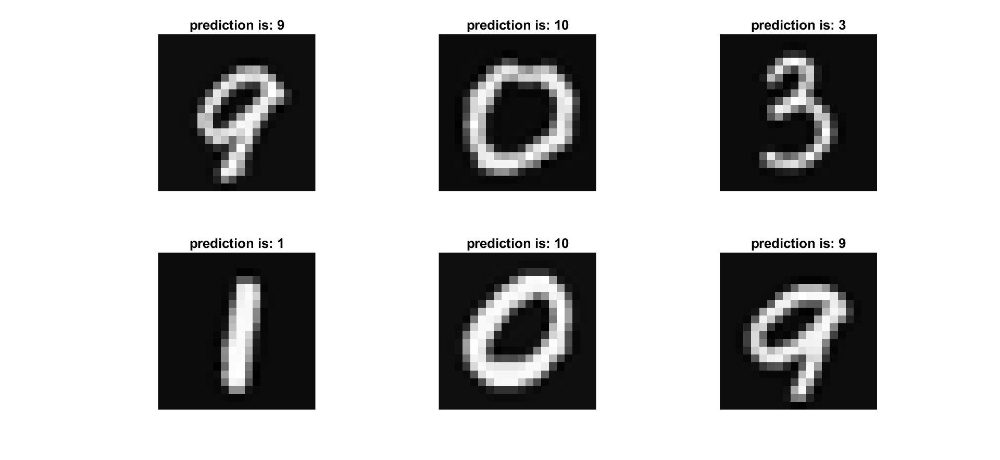
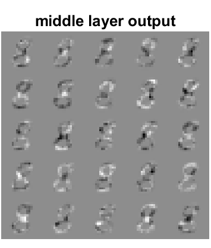

# Three-layer-Neural-Network-from-scratch
In this repository a simple 3 layer neural network implemented from scratch in matlab.
If you can read persian language you can read 'report-in-persian' else in following I provide some descriptions.

## Read Data
we use hand-written numbers provided in 'hand_digit_data.mat' for training our network showed in below figure:

you can see some data with its corresponding label in following:

## Implementation
I implemented backpropagation algorithm for training a simple 3 layer fully connected neural network.
This FC architecture is made up of 400->25->10 neurons with sigmoid activation function.
## Results
For test data I achieved accuracy of 87.6 for 10 class classification
some prediction are demonstrated in next figure:

## features extraction
I reshaped the output of first layer and reshape it to a 20*20 and show it. these are extracted features of the network in middle layer.

