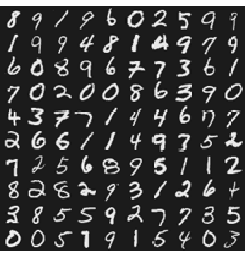
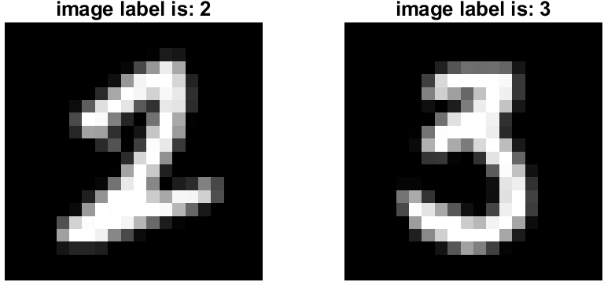

# Three-layer-Neural-Network-from-scratch
In this repository a simple 3 layer neural network implemented from scratch in matlab.
If you can read persian language you can read 'report-in-persian' else in following I provide some descriptions.

## Read Data
we use hand-written numbers provided in 'hand_digit_data.mat' for training our network showed in below figure:

you can see some data with its corresponding label in following:

